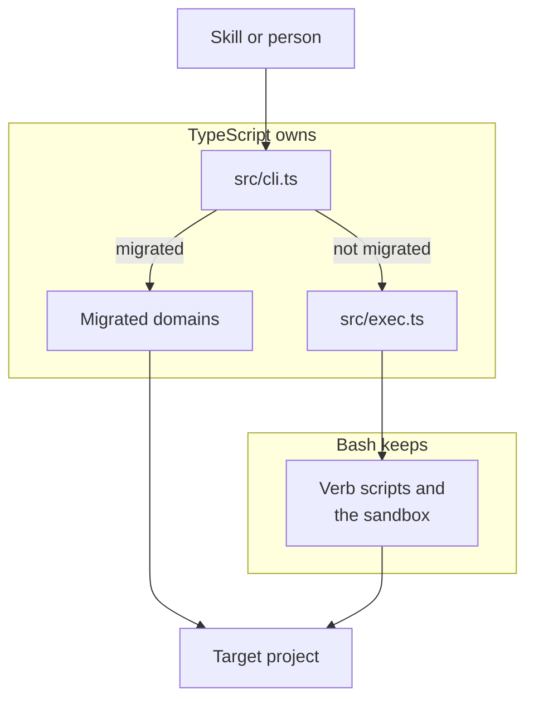

# CLI boundary

Which half of a command runs in TypeScript, which half is still bash, and what sits on the seam.

Every invocation enters at one place. `src/cli.ts` registers subcommands through commander and decides, per verb, whether the work runs here or downstream. A migrated command declares its real option surface, so a mistyped flag fails with a suggestion. A verb still on bash carries `allowUnknownOption()` and parses nothing, which keeps the flag surface owned by the script that documents it.

The seam is one file. `src/exec.ts` resolves the toolkit root and spawns bash, so a command file that has not migrated stays a thin pass-through and behavior changes land in the script rather than in two places. Domains migrate a verb at a time rather than in a single rewrite, and that is what let every dispatcher be deleted before all of its verbs had moved.

Bash keeps two things by decision rather than by backlog. `manage-sandbox.sh` stays permanently, and `read_frontmatter_field` stays because three list scripts call it once per field inside a loop, where routing through the CLI would cost a process per read. Traffic runs the other way too, since a bash script needing a migrated capability shells into the CLI by path rather than through the globally linked `aitk`, which is what makes a linked worktree exercise its own code instead of the main checkout's. `.claude/context/cli.md` holds the TypeScript side and `.claude/context/scripts/index.md` holds the bash side.
