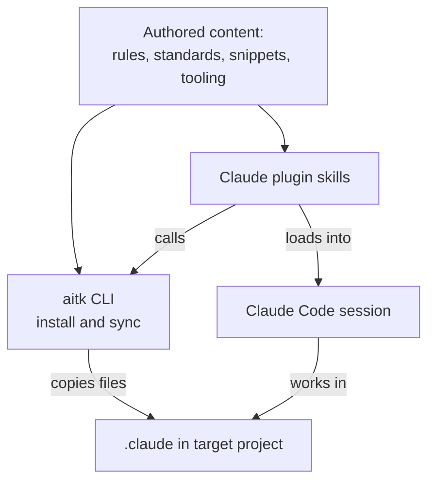

# Components

The parts inside the boundary, arranged by which path each one uses to reach a project.

Source: code. Fidelity is lower than prose-driven diagrams. Verify against the project's intent.

The structure worth seeing is the split into two paths, because the file tree shows the folders but not which of them travel by which route. Content under `governance/`, `standards/`, `snippets/`, and `tooling/` is copied. A per-domain `install` or `sync` command reads it here and writes it to a fixed path under the target project's `.claude/` folder, so the target holds a real file it can read without the toolkit present. Skills under `claude/skills/` are never copied. The marketplace loads them into a session from this repository, which is why a skill edit reaches users on merge while a standards edit reaches them only when someone runs a sync.

The edge from the skills to the CLI is the constraint that keeps the two paths from diverging. A skill detects the CLI and calls it. It does not reimplement what the CLI does, so a rule about how content installs has exactly one implementation and the skill stays a thin caller. The same principle drives every domain having a `list` command with a `--json` flag, which lets a skill read a catalog at runtime instead of hardcoding names that would go stale.

One wrinkle is invisible above. The toolkit consumes its own output. Standards and snippets are authored at the repository root and installed to `.claude/standards/` and `.claude/snippets/` here as well as in a target, and that consumed copy is committed and regenerated by `bun run check`. Every rule and skill can then reference `.claude/standards/X.md` and have the path resolve identically whether it runs in this repository or in a project that installed from it. See `.claude/context/standards.md` for the sync mechanism and `.claude/context/cli.md` for where the TypeScript surface hands off to bash.
