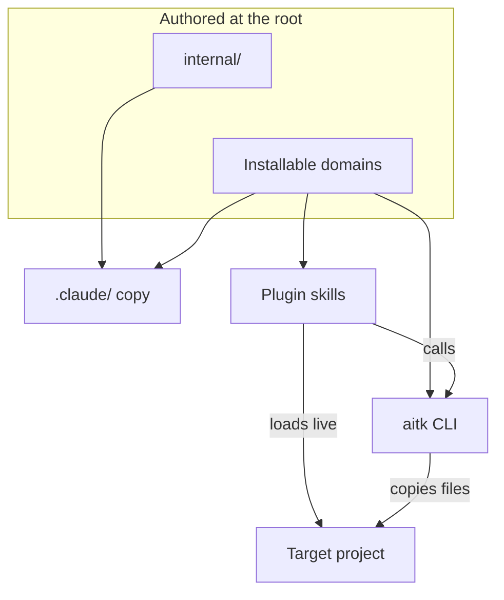

# Components

The parts inside the boundary, arranged by which of them ships and which of them cannot.

The split worth seeing is the one on the right, because the folder tree shows the domains but not which of them travel by which route. Content under `governance/`, `standards/`, `snippets/`, and `tooling/` is copied, and a per-domain install or sync command writes it to a fixed path under the target's `.claude/`, so the project holds a real file it owns and edits without the toolkit present.

Skills are never copied, and the marketplace loads them into a session straight from this repository, which is why a skill edit reaches users on merge while a standards edit reaches them only when someone runs a sync. The edge from the skills to the CLI is what keeps the two channels from diverging, since a skill reads a catalog through a `list --json` verb and then executes the CLI rather than restating what it does.

`internal/` is the node that reaches no delivery channel, and its position is the enforcement. Toolkit-internal runbooks and dev helpers live there because nothing inside the shipped plugin tree reaches it. A filter at each entry point was the alternative, and it is what this repository ran until it failed. Two entries in the plugin are symlinks an installer dereferences and copies whatever sits behind, so five internal files reached every plugin cache with no code left in the path to filter them out.

The consumed copy is the wrinkle a reader would not guess. Standards, snippets, and `internal/` are all mirrored from the root to `.claude/` here, the first two exactly as they land in a target and the third into a path no target ever sees, and that copy is committed and regenerated by `bun run check`.

A fourth surface arrives by a different route, since `.claude/rules/` is a subset of the authored rules rather than a mirror of them and resolves through the stack machinery instead. Every rule and skill can then cite `.claude/standards/X.md` and have the path resolve the same way in both places. <!-- audit-ignore-citations --> See `.claude/ARCHITECTURE.md` for the decisions behind each of these and `.claude/diagrams/components-cli.md` for where the code inside the CLI hands off to bash.
