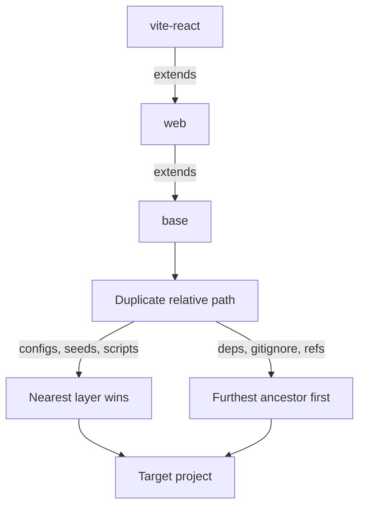

# Stack resolution

What a target receives when three layers of a stack chain ship the same relative path.

A stack is a folder of golden configs, seeds, a manifest, and a reference, and it ships only its own slice. `base` carries what every project needs, `web` adds what every web project needs, and a framework layer such as `vite-react` adds the glue for one build tool. The chain is what a target actually receives, so the question the diagram settles is what happens when two layers in that chain ship a file at the same relative path.

Two answers, which is the part the folder layout hides. Configs, seeds, and scripts resolve nearest stack first, so a file seen in `vite-react` blocks the same path from `web` and `base`. Dependencies, gitignore entries, and references resolve from the furthest ancestor inward, so `base` is read first and a later layer adds only what is missing. The split is inherited from the bash this replaced rather than designed, and the TypeScript port preserved both directions on purpose, because unifying them would silently change what an existing target receives on its next sync.

The walk is `scan` in `src/tooling/scan.ts`, where a `seenConfigs` set is what makes nearest-first work and `ancestorsFirst` is what reverses the read for the other three categories. `.claude/context/tooling.md` carries the manifest format, the per-category sync behavior, and the reason `python` extends `base` directly instead of going through `web`.
