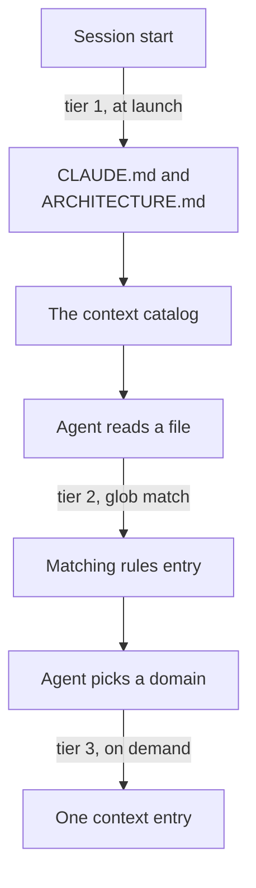

# Context assembly

What a session has loaded at each point in its life, and what has to happen before a tier arrives.

Three tiers, ordered by when they arrive rather than by how much they matter. Tier 1 is paid on every session whatever the task, which is why the only content that belongs there is behavior that applies to every task. Tier 2 costs nothing until a file matching a rule's `paths:` glob is read, so a rule about TypeScript never reaches a session editing markdown. Tier 3 costs nothing until a session decides it needs a domain, and it is the tier that scales, because a new domain adds one entry nobody loads by default.

Vertical order here is time rather than importance, which is the shape the first two attempts missed. Every tier ends up in the same context window, so a funnel converging three lanes on one window node adds a crossing bundle and states something a reader already assumed. Three tier lanes side by side was the second attempt and rendered diagonal. What the spine carries instead is the trigger on each edge, which is the part that differs between tiers and the part a placement decision turns on.

The last edge is the one tier 3 would not work without. A nested `CLAUDE.md` below the working directory loads lazily and costs roughly what tier 3 costs, and it was the rejected alternative, because nothing announces that it exists. The catalog is the fix and it sits in tier 1 for that reason, listing every entry up front so a session picks the one it needs before touching the domain. The tier table and the placement rules are in `.claude/context/context-model.md`, and the catalog itself is `.claude/context/index.md`.
