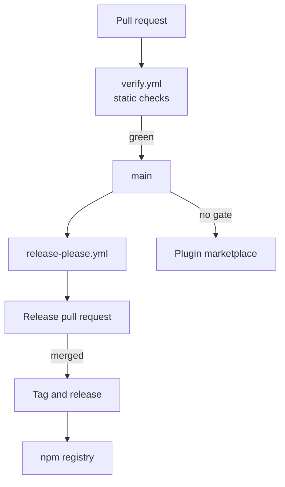

# Deployment

What stands between a commit and a version a user outside this repository can install.

This project deploys to a registry and a marketplace rather than to a host, so the diagram shows gates instead of infrastructure. There are two of them on the package path. Every pull request runs `verify.yml`, a single job that installs dependencies and runs `bun run check:ci` for lint, types, tests, formatting, and spelling. A merge to `main` then runs `release-please.yml`, which accumulates conventional commits into a release pull request. That second pull request is the human gate on versioning. Nothing publishes until someone merges it.

The two channels release at different speeds, which the shape above is meant to make obvious. The npm package waits for a tag, so a fix reaches CLI users only after a release is cut. The plugin has no publish step at all. Its marketplace manifest points at this repository, so a skill edit is live for plugin users as soon as it lands on `main`. A change touching both surfaces therefore reaches its two audiences at different times, and a skill that calls a CLI flag added in the same commit will run against whichever CLI version the user has installed.

One guard runs before anything is cut. The release job checks that `NPM_TOKEN` exists and authenticates against the registry before release-please runs, so an expired credential fails the workflow instead of producing a tag and a GitHub release that no publish can follow. Recovering from that state means republishing a tag by hand, which the workflow supports through a dispatch input that names one. Job definitions live in `.github/workflows/` and the version bump targets are configured in `release-please-config.json`.
