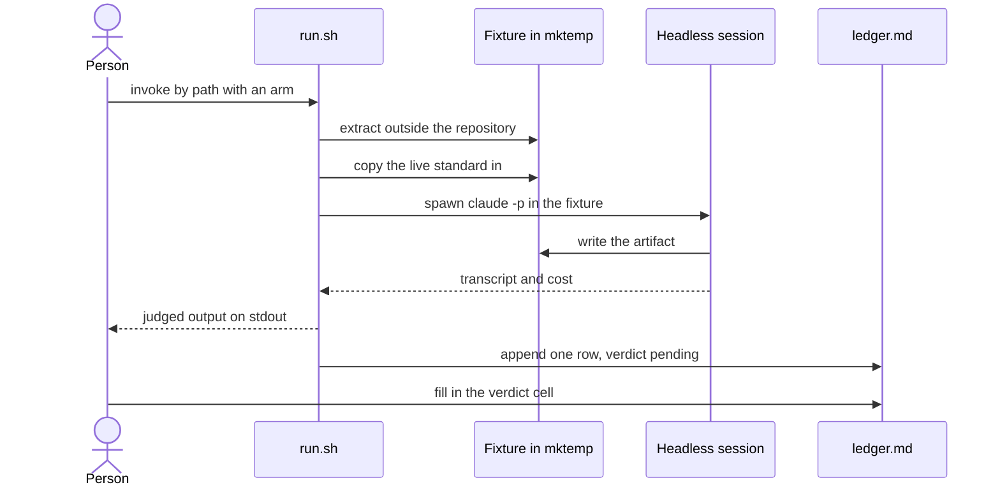

# Eval harness

What happens between someone deciding to spend a dollar and a row in the ledger that records what it bought.

The harness asks one question. Can a session that has never seen a standard author a conforming artifact from that standard alone? It says nothing about whether the artifact is useful, which is a different question with a different design, and the arms here are built for the first one only.

Two edges carry most of the reasoning. The first message starts at a person rather than at a command, and that is deliberate: the harness is unreachable from `aitk` because a run that spends real money should be started by someone deciding to spend it. The extraction lands outside this repository for a reason of the same kind. A fixture sitting under the root would load the toolkit's own `CLAUDE.md` through the ancestor chain, and the session under test would arrive already knowing the conventions the run is trying to measure.

The last two messages are one record split by what each costs to keep. The ledger row is small and committed, while the raw transcript holds the full text of every file the session read, so it lands in gitignored scratch and is promoted by hand only on the day it becomes evidence for a claim. The verdict arrives blank because judging is a person's job against criteria fixed before the run, which is what stops a miss from being reinterpreted afterward. `scripts/eval/README.md` covers the arms, the ablation variants, and the harness behavior that forced the permission flag.
