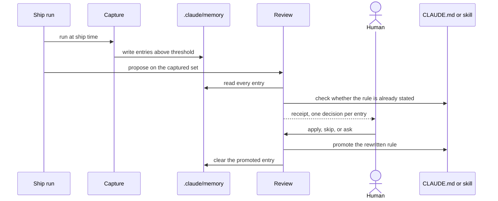

# Memory lifecycle

Where a lesson learned mid-session goes, and what has to happen before it changes how the agent behaves.

`.claude/memory/` is a holding pen rather than a destination. Capture runs at ship time and writes what the session proved durable, held to a threshold that keeps first-occurrence slips out. Review then defaults every entry to promote or delete, so an entry that survives a review untouched is the exception and needs a reason such as an open task still depending on it.

The two checks before a promote are what keep the pen from growing into a second set of rules. Review greps the destination surface first, and a rule already stated there is deleted rather than promoted, because a memory file claiming it is documented elsewhere is not evidence. A rule that resists crisp one-line phrasing is also deleted, since a vague entry costs a read on every future session and changes no behavior. Nothing is promoted unchanged, and the rewrite matches the destination's tone.

The human message is the gate, because a promote mutates how the agent operates on every later session, and a ship run stops at the proposal rather than applying on its own. Destination follows scope: cross-domain behavior goes to `CLAUDE.md`, a rule firing only inside one domain goes to that skill body, and a coding-standards rule is handed off to governance rather than authored inline. `claude/skills/claude-memory-capture/SKILL.md` and `claude/skills/claude-memory-review/SKILL.md` carry the thresholds and the five review phases. This entry is also where the catalog records its own ceiling, since it is the last one added: nine is the stopping point because maintenance binds before candidate supply does, and five more defensible kinds would each cost a render and four visual checks on every sweep.
