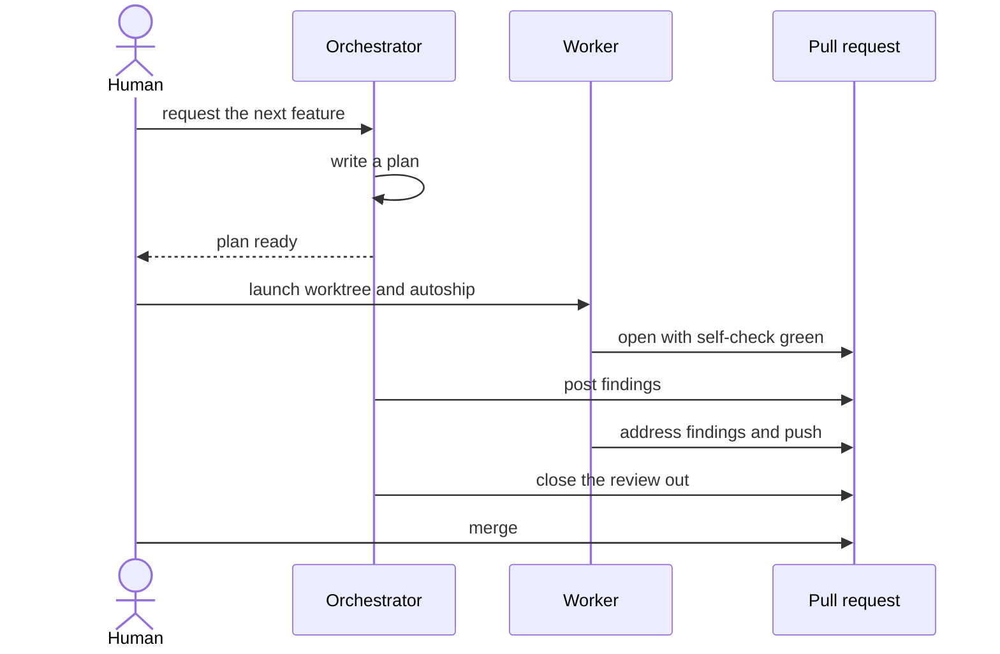

# Request flow

How one feature travels between sessions, with the pull request as the channel review runs on.

Nothing in this project serves traffic, so the interaction worth drawing is the one between the sessions that build it. Two roles split by vantage rather than by capability. The orchestrator is one warm, long-lived session that holds the roadmap and cross-feature context. Each worker is a cold session in its own git worktree that sees a single plan and halts at the pull request. Both are ordinary Claude Code sessions.

Review travels on the pull request rather than through chat, which is the load-bearing choice here. Findings posted to the pull request become a durable artifact both sessions read. They survive either session ending and anchor to the change, which removes the copy and paste that would otherwise route every finding through the human. The two orchestrator passes carry different headings so a thread can be scanned for state without opening a comment.

The worker's own self-check and the orchestrator's review are not the same pass run twice. The worker asks whether it built the plan and whether it passes, and it is structurally blind to its own misreadings, because the same misreading wrote both the code and the review. The orchestrator asks whether the change is right and whether it fits, and it can question the plan itself. The merge stays a manual human gate at the end of both. `docs/operating-model.md` carries the role table and the feature sizing rules.
