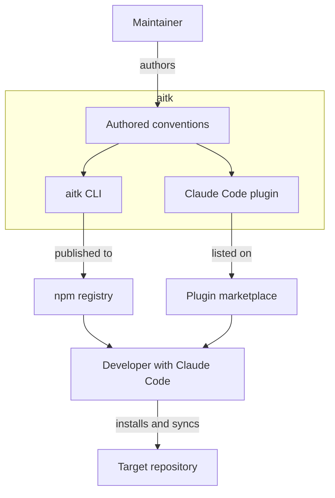

# System context

Who reaches for the toolkit, and which systems carry its output to them.

The toolkit is a store of conventions written as text. Governance rules, prose standards, seed planning documents, and Claude Code workflow skills all live here as markdown and configuration rather than as a library a project imports. The problem it addresses is repetition. A team that re-authors the same rules in every repository ends up with copies that drift apart, and an agent working across those repositories can no longer rely on a consistent signal.

Two channels carry that content outward, and they are independent. The CLI publishes to the npm registry under `@erclx/aitk`, which a developer installs like any other command line tool. The plugin is listed on a Claude Code marketplace, which loads its skills into a session directly from this repository. A developer usually takes both, because the skills call the CLI rather than reimplementing what it does.

The boundary ends at the developer's machine. Nothing here runs as a hosted service, and the toolkit ships no runtime code into a target project. It writes files into that project and then steps out of the way, which is why the last edge points from the developer rather than from the toolkit. Scope, goals, and the explicit non-goals behind that choice are recorded in `.claude/REQUIREMENTS.md`.
