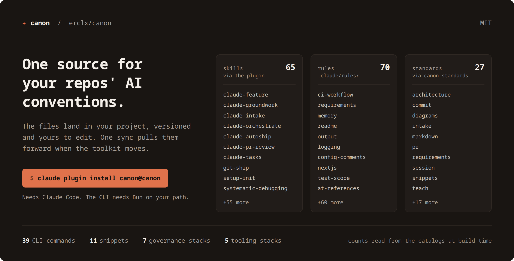
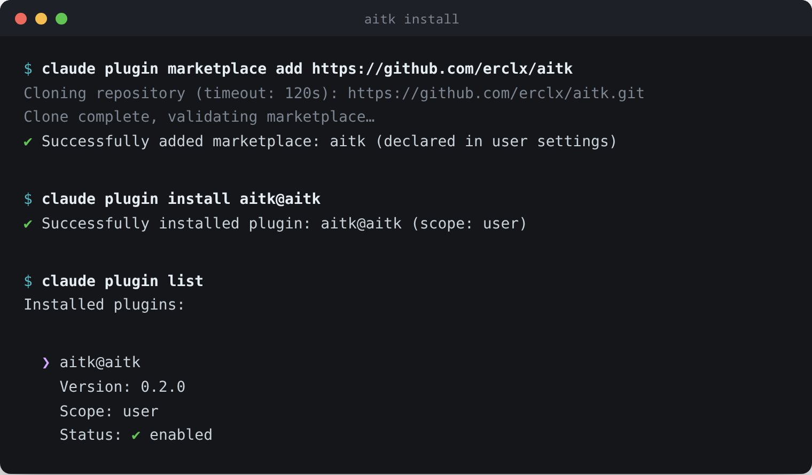

# canon

[](https://www.npmjs.com/package/@erclx/canon)
[](https://github.com/erclx/canon/actions/workflows/verify.yml)
[](LICENSE)

One source for your repos' AI conventions. Install once, sync everywhere.



If you work across more than one repository and your AI setup has started to drift between them, this is for you. The counts above are read from the catalogs when the image is built, so they're what the repo actually ships today.

## Install

Add the marketplace, then install the Claude Code plugin.

```bash
claude plugin marketplace add https://github.com/erclx/canon
claude plugin install canon@canon
```



The skills land as `/canon:<name>`. If your session was already open, run `/reload-plugins` to pick them up.

Several skills call the `canon` CLI to read catalogs and run installs, and the plugin doesn't put it on your path. Install it from the registry.

```bash
bun install --global @erclx/canon
```

[Bun](https://bun.sh) is the CLI runtime and has to be on your path first. Confirm the install by resolving `canon --help`.

## Update

Nothing refreshes on its own. Claude Code ships auto-update off for third-party marketplaces, so an installed copy serves whatever version it was installed at until you refresh it.

```bash
claude plugin marketplace update canon
claude plugin update canon@canon
canon upgrade
```

The first two update the skills, the third updates the CLI, and they move independently. Restart Claude Code, or run `/reload-plugins`, to pick the skills up.

`canon upgrade` reads the package manager off its own install path and reinstalls with that one, so you don't have to remember which put it there. It names what it detected before it runs anything, and it refuses a source checkout rather than reinstalling over your clone.

You don't have to wait until something breaks to find out you're behind. `canon sync --check` and `canon claude skills drift` both report the installed version against the newest published one, and neither changes its exit code over it, so an offline machine reads unknown rather than red.

To stop doing this by hand, turn auto-update on once under `/plugin` in the Marketplaces tab. Confirm what you are running with `canon --version` and `claude plugin list`.

## Why

Every AI coding setup accumulates the same assets. Prompts to reuse, rules agents should follow, slash commands, skills, seed docs, sync scripts. Once you have enough projects, your copies drift and your agents stop getting consistent signals.

Three design choices shape the toolkit.

- Agent-first: every command has a non-interactive path and a JSON catalog. If a Claude Code skill or any other agent cannot drive the CLI without prompts, the design is wrong.
- Text-native: conventions, rules, and prompts are authored as markdown that you and your agents read the same way. No hidden behavior, no compiled state.
- One source, many consumers: this repo is the authoritative copy. Your projects install and sync on demand, never author in place.

Two limits worth knowing before you install. Claude Code is the only agent runtime the plugin targets, and the CLI needs Bun on your path. Snippets are the one surface that also travels to Gemini chat.

## What is inside

Each domain has a canonical source in this repo and a thin install or sync CLI on your side. The links run to internal narrative, written for someone maintaining the toolkit rather than installing it, so skip them on a first pass.

- [Claude Code plugin](.claude/context/claude-plugin/index.md): skills for planning, review, docs sync, and the git ship chain
- [Governance rules](.claude/context/governance/index.md): Claude rules and stacks, installable per project
- [Standards](.claude/context/standards/index.md): shared authoring conventions, read by name rather than installed
- [Snippets](.claude/context/snippets.md): reusable prompts for Claude and Gemini chat
- [Tooling stacks](.claude/context/tooling.md): golden configs, seeds, and references per framework
- [Design system](.claude/context/design.md): `DESIGN.md` token shape, extract skill and its two paths, render command
- [Slides](.claude/context/slides.md): `SLIDES.md` source, layout catalog, render command, draft skill
- [Transcripts](.claude/context/transcripts.md): fetch a YouTube transcript with metadata frontmatter via `canon transcripts`
- [Sandbox](.claude/context/sandbox/index.md): scenario-based scaffolds for verifying each domain flow

## Documentation

Scaffolding your first project? Start with target projects, then the AI workflow loop. Everything else answers questions that arrive later.

- [AI workflow](docs/ai-workflow.md): feature-development loop inside a toolkit-managed project
- [Operating model](docs/operating-model.md): orchestrator and worker roles for building across parallel sessions
- [Visual design workflow](docs/visual-design-workflow.md): tiered guide for design and wireframe authoring
- [Target projects](docs/target-projects.md): scaffold, add a domain later, sync upstream drift
- [Agents](docs/agents/index.md): CLI flags, exit codes, and JSON output shapes
- [Docs index](docs/index.md): every reference doc in this repo

## Development

Working on the toolkit starts from a clone. Running the CLI doesn't, since it installs from the registry. Skip this section unless you're changing the toolkit itself.

### Prerequisites

- [Bun](https://bun.sh) for the CLI runtime and scripts
- [Git](https://git-scm.com) with worktree support
- [GitHub CLI](https://cli.github.com) (optional) for ship flows
- Shell: `zsh` or bash 4+ (`brew install bash` on macOS).

Clone the repo, then run the bootstrap script. It installs dependencies, links the CLI globally, and adds the Claude Code shell aliases to your `~/.zshrc`.

```bash
git clone https://github.com/erclx/canon.git
cd canon
bun install
bun run bootstrap
```

The script is idempotent, so re-run it after pulling upstream changes without duplicating anything. It confirms the install by resolving `canon --help` on the last step. See [zshrc aliases](docs/zshrc-aliases.md) for what each alias does.

With the CLI linked, scaffold a fresh project.

```bash
mkdir ~/my-project && cd ~/my-project
git init
canon init
```

`canon init` installs base tooling configs, Claude seeds, and governance rules in one pass, and scaffolds a `.claude/wiki/` stub for your project's own reference pages. Governance defaults to the `base` stack, so a bare init lands the coding and doc-authoring rules in `.claude/rules/`. Each rule names the standard it answers to and reads it with `canon standards <name>`, so no corpus is copied into your project. Pass `--stack <name>` for a framework stack, or `--skip governance` to leave rules out. A snippet resolves the same way, reached at its `@` reference through the plugin's live `claude/snippets` symlink rather than a copy. Run `canon tooling list --json` to see the catalog.

For the full journey from scaffold through adding a domain later to syncing upstream drift, see [target projects](docs/target-projects.md).

## Contributing

Portfolio project. Issues are welcome. Pull requests are accepted by invitation only, so open an issue rather than a branch. Read the [contributing guidelines](CONTRIBUTING.md) for the local loop, the authoring split, and the commit convention before you file anything.

## License

[MIT](LICENSE)
